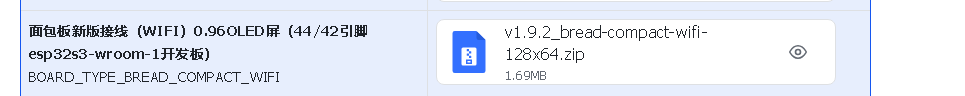
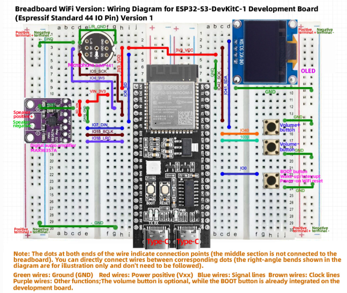

# GPIO-control-with-xiaozhi-esp32
These are the same files from the project: xiaozhi-esp32(https://github.com/78/xiaozhi-esp32), but I modified some of their code to work with other pins and servos using the board "bread-compact-wifi" which is designed for the ESP32s3 WROOM N16R8. The other configurations can be found in the original project.
GPIO Control with XiaoZhi-ESP32
This project is based on xiaozhi-esp32, originally developed by @78. I’ve adapted the code to work with different pins and servos using the bread-compact-wifi board, designed for the ESP32-S3 WROOM N16R8.

🔧 Modifications
Compared to the original project:

Changed pin assignments to match my board layout

Added support for LED control and servo movement(simple)

Adjusted configuration files for compatibility with ESP32-S3 WROOM N16R8(Need to install ESP-IDF: https://github.com/espressif/idf-installer)

📦 Installation
Clone this repo:

bash
git clone https://github.com/WrongCaesar9/GPIO-control-with-xiaozhi-esp32
Flash the firmware to your ESP32-S3 board using your preferred method.

Connect LEDs and servos according to your pin configuration.

Enjoy your AI-powered hardware assistant!

📄 License & Credits
This project is a modified fork of xiaozhi-esp32. All original credit goes to the author. Please refer to the original repository for licensing terms. If you plan to redistribute or build upon this work, make sure to respect the original license.

For the firts use you need to configure in this web: https://web.esphome.io/

Flash tool/web programming firmware (without IDF development environment): https://ccnphfhqs21z.feishu.cn/wiki/W14Kw1s1uieoKjkP8N0c1VVvn8d

ESP-IDF Development Environment Setup and XiaoZhi Compilation: https://xiaozhi.dev/en/docs/development/esp-idf-setup/

Xiaozhi AI hardware construction guide: https://xiaozhi.dev/docs/usage/hardware-guide/

 Diagrama de conexión. (s. f.). Keyestudio. https://docs.keyestudio.com/projects/ESP32S3_128X64/en/latest/OLED128x64/OLED128x64.html

An other guide for wirng and flashing: https://docs.keyestudio.com/projects/ESP32S3_128X64/en/latest/OLED128x64/OLED128x64.html